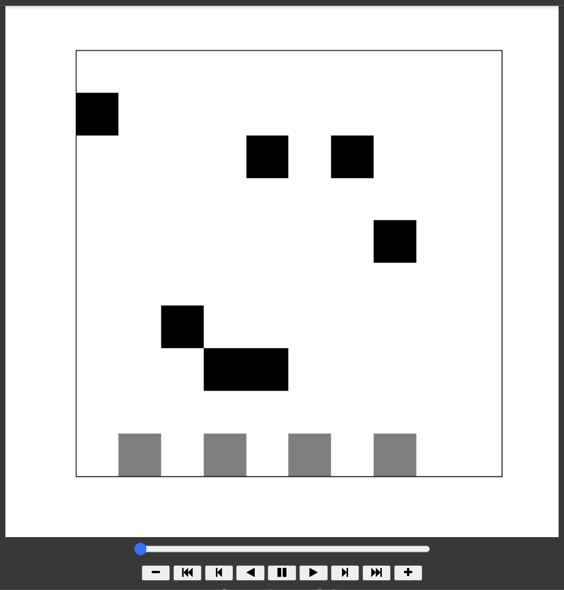

# Carpool Simulation

A 3D simulation of a Carpool which aims to improve movility

## Tech HELLO

- Backend - Python (mesa framework)
- Frontend - Unity

## Team

- Pedro Alosno Moreno Salcedo [@pedroalonsoms](https://github.com/pedroalonsoms)
- Felipe de Jesus González Acosta [@felipegonac0](https://github.com/felipegonac0)
- Angela Sofía Pontón Ochoa [@AngiePO](https://github.com/AngiePO)
- Daniel Arguedas Alvarado [@Daniel-arg](https://github.com/Daniel-arg)

## Funciones

- [ ] Agentes: Coche(activo), Persona (reactivo), Parada (posición)
- [ ] El investigador introduce la cantidad de probabilidad que aparezca un coche y una persona y un step, harcodeando los steps. Alternativas: (Cantidad carros, Cantidad personas, Probabilidad Carro, Probabilidad Persona y número de steps)
- [ ] Implementar en Unity una Scene para el investigador que ponga el número de presonas y carpools totales, y se lo mande en un JSON que lo lea el Python
- [ ] Aparecen todas las personas durante la simulación distribuidas aleatoriamente en las paradas al igual que los coches
- [ ] Personas y coches aparecen aleatoriamente durante la simulación
- [ ] A los coches se les asignan sus personas a recoger al momento que estos salen, no tienen tiempo de espera.
- [ ] Las personas son unicamente reactivas.
- [ ] Los coches checan si hay una persona en los 8 vecinos (sin diagonales) y las recogen cuando les pasan a un lado.
- [ ] Cada persona tiene un id del coche que le asignarion, el cual puede ser nulo si no hay coche que se le asignó.
- [ ] Llevar un contador de cuántas persoans personas fueron recogidas y no recogidas.
- [ ] Tener una pool de coches para saber si está disponible para dar una ruta o ya la dio.
- [ ] El modelo da prioridad a recoger a las personas de la primera parada que encuentra.
- [ ] Cada coche puede recoger a un máximo de 4 personas.
- [ ] Cada coche registra la cantidad de personas que recogió.
- [ ] Harcodear las rutas y paradas en el Python.
- [ ] Las personas no tienen un destino como tal.
- [ ] Las personas asignadas a los coches van por jerarquía del agente parada.
- [ ] El coche calcula en cada step cuales son sus vecinos (Von N)
- [ ] La simulación se detiene cuando todos los coches hayan llegado a su estación final.
- [ ] El coche al ser instanciado se le asignan las personas que va a recoger.

## Credits

- Splash Screen Photo: https://unsplash.com/photos/pN-Prl1jMVM
